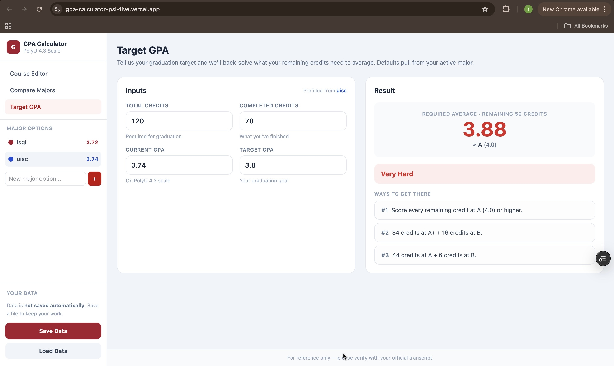
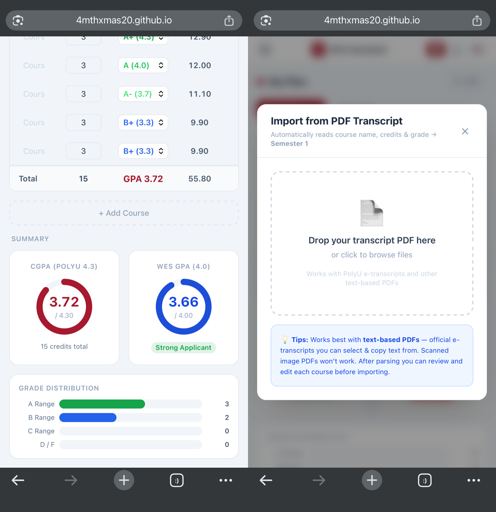

# GPA Calculator

A GPA planning tool built around the PolyU 4.3 grading scale.

It helps you:

- track courses by semester
- compare different options side by side, e.g. majors, study plans, or whether to go on exchange
- back-solve the average GPA your remaining credits need to hit a target
- import transcript data from PDF files
- save and reload your planning data manually

Live site:
[https://gpa-calculator-psi-five.vercel.app/](https://gpa-calculator-psi-five.vercel.app/)

## Preview

### Desktop



### Mobile



## Features

### 1. Course Editor

- Create multiple options to model different scenarios (majors, study plans, exchange semesters, etc.)
- Add, rename, recolor, and delete options
- Organize courses by semester
- Edit course name, credits, and grade manually
- See semester totals and cumulative GPA instantly
- WES 4.0 GPA shown alongside PolyU cGPA in the same summary panel

### 2. PolyU 4.3 GPA Summary

- Uses the PolyU 4.3 scale
- Calculates GPA from weighted grade points and credits
- Shows total credits and grade distribution
- Highlights A/B/C/D-F ranges visually
- Also surfaces a WES 4.0 equivalent (with `A+` capped at `4.0`) next to the cGPA

Supported grades:

`A+ A A- B+ B B- C+ C C- D+ D F`

### 3. Compare Options

- Compare multiple options in one place
- Rank options by PolyU GPA
- View total credits, number of courses, and semester counts
- WES GPA and admission outlook shown for each option
- Use side-by-side comparison for any GPA-affecting decision, like choosing a major or whether to go on exchange

### 4. Target GPA

- Enter total credits required for graduation, completed credits, current GPA, and target GPA
- The app back-solves the average GPA your remaining credits must earn
- Feasibility is labelled (Easy, Moderate, Challenging, Very Hard, Extreme, Impossible, Already Achieved)
- Suggests concrete grade plans, e.g. a single grade everyone hits or a two-grade mix like `30 credits at A + 20 credits at B`
- Defaults pre-fill from your active option (still fully editable)

### 5. PDF Transcript Import

- Import courses from text-based PDF transcripts
- Extracts course name, course code, credits, and grade
- Supports common PolyU transcript formatting
- Includes parsing fixes for special PDF glyphs that can affect grades like `A-` or `B+`
- Lets you review and edit imported rows before saving them into a semester

Notes:

- Works best with text-selectable PDFs
- Scanned image PDFs are not supported
- Mobile upload support is included, but browser behavior can still vary by device

### 6. Manual Save / Load

- The app starts fresh when opened
- Data is not stored automatically
- Export your plans as a JSON file
- Import a saved JSON file later to continue your work

## Screens

- `Course Editor`: build and edit semester-by-semester plans (with cGPA + WES GPA summary)
- `Compare Options`: rank and compare different options side by side
- `Target GPA`: back-solve what your remaining credits need to average

The layout is responsive and supports both desktop and mobile navigation.

## Tech Stack

- React
- Vite
- Tailwind CSS
- Zustand
- `pdfjs-dist`

## Project Structure

```text
.
├── README.md
├── package.json
└── react-app
    ├── package.json
    ├── src
    │   ├── components
    │   ├── store
    │   └── utils
    └── vite.config.js
```

## Local Development

From the repository root:

```bash
npm install --prefix react-app
npm run dev
```

Or inside `react-app`:

```bash
npm install
npm run dev
```

## Build

From the repository root:

```bash
npm run build
```

This runs the Vite production build in `react-app`.

## Deployment

The project is deployed on Vercel from the `main` branch.

- Vercel auto-detects the Vite framework when the project's Root Directory is set to `react-app`
- `vite.config.js` switches its `base` to `/gpa-calculator/` only when building under GitHub Actions, so the same code can also be served from GitHub Pages without a separate config

Pushes to `main` trigger an automatic Vercel deployment.

## Use Case

This project is especially useful for students who:

- study under the PolyU 4.3 grading system
- want to compare different paths or scenarios (majors, exchange, electives)
- need to back-solve what their remaining credits must average to hit a graduation target
- want to import transcript data instead of entering everything manually

## Disclaimer

For reference only, please verify with official transcript.

## License

No license has been added yet.
